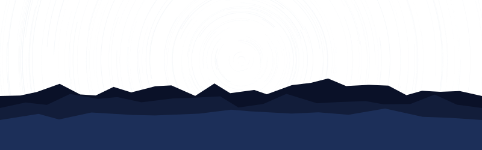

<!-- Celestial Header -->

  

 

  

    "The Cosmos is within us. We are made of star-stuff. We are a way for the Universe to know itself." 
    — Carl Sagan
  

  <h3 style="color: #F0F4F8; letter-spacing: 2px; margin-bottom: 10px;">
    <strong>✦ Hii!! I'm Kelina Vipu ✦</strong>
  </h3>
  

 

<h2 align="center" style="font-weight: 300; color: #F0F4F8; letter-spacing: 1.5px;">About My Orbit</h2>

  A learner navigating the vast universe of computation, drawn to patterns, intelligence, and meaning. 
  Currently exploring machine learning and building systems that connect ideas with impact.

 

<h2 align="center" style="font-weight: 300; color: #F0F4F8; letter-spacing: 1.5px;">Tech Constellation</h2>

  <!-- Languages & Frameworks -->
  
    
  <!-- Cloud, DB, & Tools -->
  
    
  <!-- Data Science / ML specific icons -->
  

 

<h2 align="center" style="font-weight: 300; color: #F0F4F8; letter-spacing: 1.5px;">GitHub Signals</h2>

  
    
  

 

<h2 align="center" style="font-weight: 300; color: #F0F4F8; letter-spacing: 1.5px;">Artifacts</h2>

| Project | Stack | About |
|:---|:---|:---|
| 🔵 &nbsp; **RAG Helpline Model** | `Flask` `LangChain` `FAISS` | Finds the right Indian helpline via natural language |
| 🟣 &nbsp; **ArogyaMaa AI** | `Python` `LangGraph` `Bhashini` | Voice-enabled maternal healthcare AI, built at a hackathon |
| 🟢 &nbsp; **Luminance** | `Flutter` `Kotlin` `Groq API` | Android screen addiction analyser and blocker |

 

<h2 align="center" style="font-weight: 300; color: #F0F4F8; letter-spacing: 1.5px;">Active Missions</h2>

  ◉ &nbsp; Navigating LangGraph deeper &nbsp;·&nbsp; <i style="opacity:0.5; font-size:11px;">multi-agent orchestration · stateful workflows</i> 
  ◉ &nbsp; Optimizing RAG pipelines &nbsp;·&nbsp; <i style="opacity:0.5; font-size:11px;">chunking · reranking · hybrid search</i> 
  ◉ &nbsp; Exploring Deep Learning &nbsp;·&nbsp; <i style="opacity:0.5; font-size:11px;">CNNs · transformers · attention</i> 
  ◉ &nbsp; Going deeper into Flutter &nbsp;·&nbsp; <i style="opacity:0.5; font-size:11px;">state management · native integrations</i>

 

  
✦ ✦ ✦

  

    A small presence in an expanding universe
  

   
  

<h2 align="center" style="font-weight: 300; color: #F0F4F8; letter-spacing: 1.5px;">Reach My Orbit</h2>

  
  &nbsp;
  

